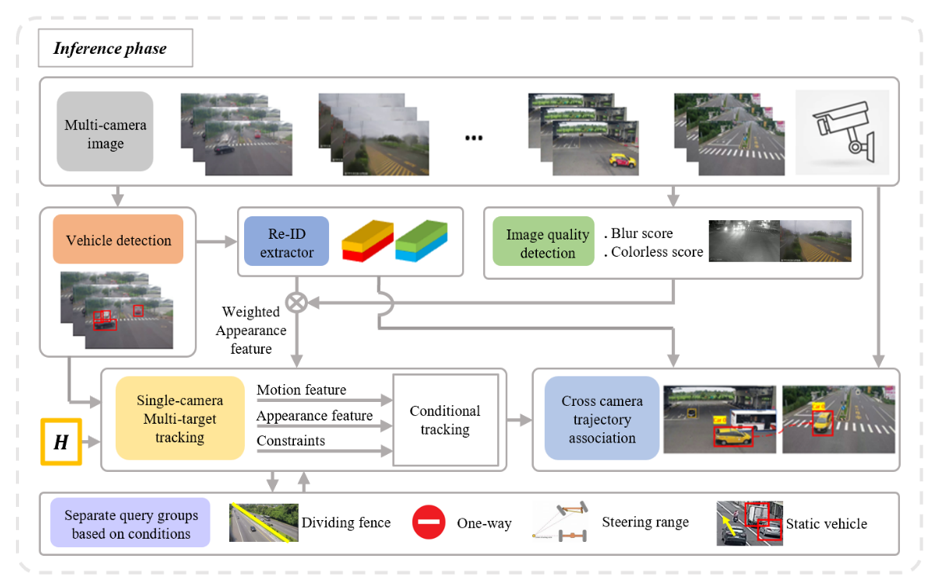

# Final Project Of Computer Vision

### Pipeline of our tracking method



### Install
This implementation uses Python 3.8, [Pytorch](http://pytorch.org/),  Cuda 11.3. 
```shell
# Copy/Paste the snippet in a terminal
git clone https://github.com/phongkhanh/CV_Final_Project.git
cd CV_Final_Project

#Dependencies
conda create -n Tracker python=3.8 --yes
conda activate Tracker
pip install torch==1.12.1+cu113 torchvision==0.13.1+cu113 torchaudio==0.12.1 --extra-index-url https://download.pytorch.org/whl/cu113
pip install --user --requirement  requirements.txt # pip dependencies
```

### How to train
#### Training yolov8
How to train
Training YOLOv8
To train YOLOv8 for object detection, please follow the official Ultralytics training guide:

👉 [YOLOv8 Training Guide](https://docs.ultralytics.com/modes/train/#clearml)

This guide includes instructions for:

+ Dataset structure and formatting

+ Model configuration

+ Training with ClearML integration

+ Command-line and Python API usage

You can also start training directly using Python as shown below:
```
from ultralytics import YOLO
model = YOLO("yolov8n.pt")  # you can also use yolov8s.pt, yolov8m.pt, etc.
results = model.train(data="coco8.yaml", epochs=100, imgsz=640, device=-1)
results = model.train(data="coco8.yaml", epochs=100, imgsz=640, device=[-1, -1])
```

Note: Replace coco8.yaml with your own dataset YAML file if you're using a custom dataset. After training, copy the best.pt weight file into the weights/ directory for inference.
#### Training fast_reid
We use [FastReID](https://github.com/JDAI-CV/fast-reid)
Please follow the [official guide](https://github.com/JDAI-CV/fast-reid/blob/master/GETTING_STARTED.md) to set up and train:

👉 FastReID Getting Started

+ This guide includes:

+ Environment setup with conda

+ Dataset preparation

+ Training commands using train_net.py

Configuration customization via .yaml files

Example training command (from official docs):
```
python tools/train_net.py \
  --config-file configs/Market1501/bagtricks_R50.yml \
  --num-gpus 1
```
You can modify the config path and dataset according to your use case.

### How to inference
 ```CUDA_VISIBLE_DEVICES=4 python demo.py --name '0902_130006_131041'``` <br>
Demo with colab: [ipynb file](https://colab.research.google.com/drive/1xrGFTbhR0yjhzXqRxamLNtGMQAe-V5sH#scrollTo=3eR65IfWoKbz)

📥 Pretrained Weights:
Download pretrained FastReID model weights from the following [link](https://drive.google.com/drive/folders/1wu82yKpQTQeICbkbNZxDEEnUzJacJ88o?usp=sharing) and place them in the pretrained/ folder